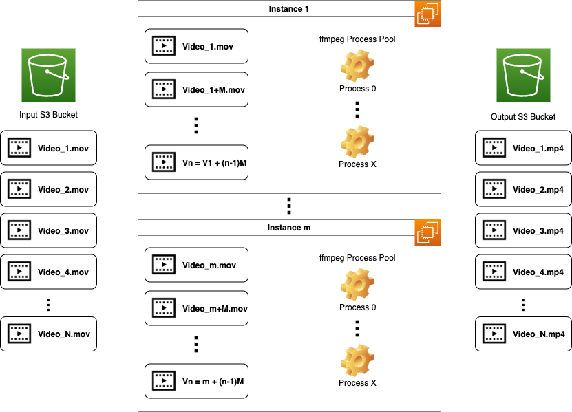

# ffmpeg-aws-spot-cluster
Configurable one-time run and self cleanup of ffmpeg running on AWS EC2 Spot. Aiming for cost efficiency and for those who don't encode often but want to harness power of aws to do the job.

Python Version: >3.5

## Basic Idea

## Development Getting Started

### pre-commit

Install [`pre-commit`](https://pre-commit.com/) to automatically run scripts when commit. On MacOS install using homebrew: `brew install pre-commit`

Then run `pre-commit install --install-hooks` on this directory.

### Installing the python package

Create virtualenv by `python3 -m venv env`
then activate it `source env/bin/activate`
Install using `pip install --editable .`

